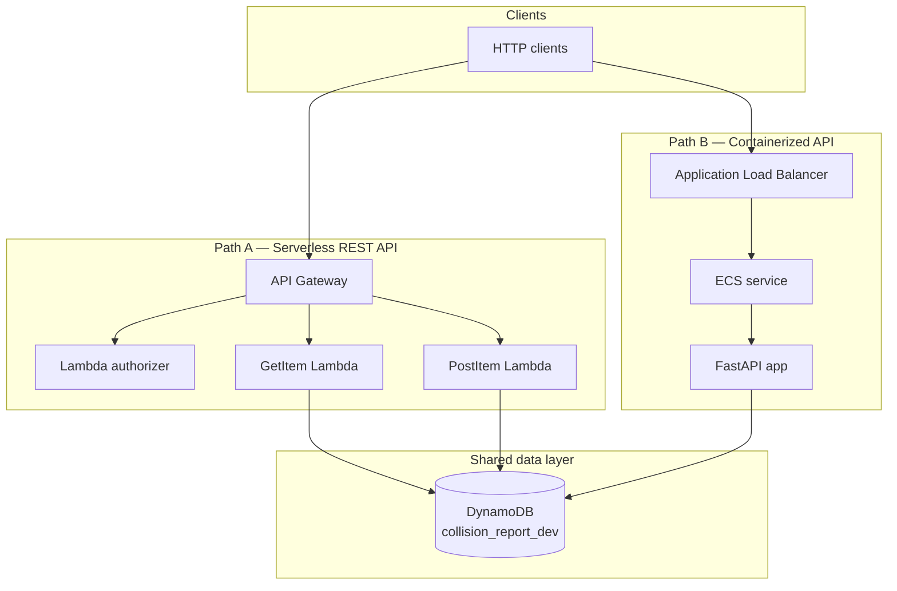
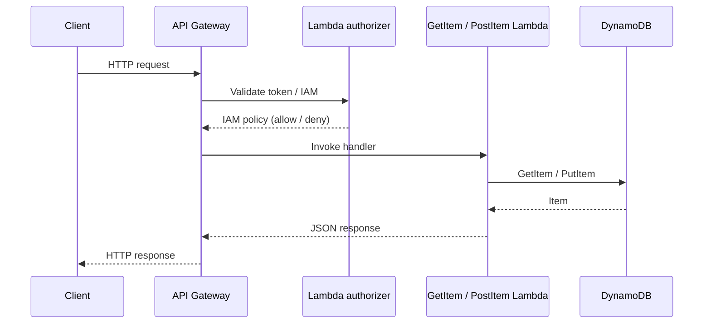
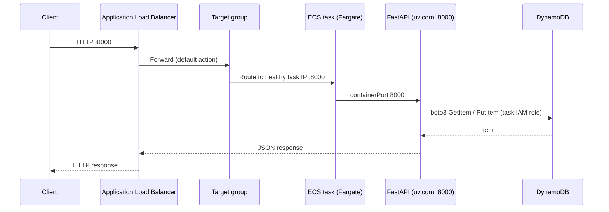
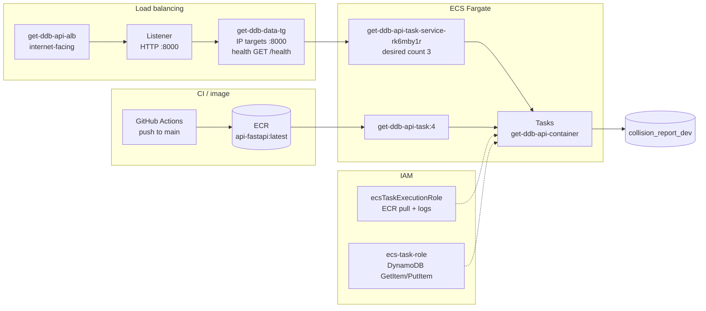

# API

Monorepo for **collision report APIs** backed by DynamoDB. The same domain logic is exposed through two deployment models so you can compare serverless (Lambda + API Gateway) against containerized (ALB → ECS) operation.

## Architecture overview

Both paths read and write the same DynamoDB table. Choose one for production, or run both in parallel for migration, load testing, or A/B comparison.



### Path A — REST API (Lambda + API Gateway)

Request flow for the serverless stack:



| Component | Location | Status |
|-----------|----------|--------|
| Lambda authorizer | `lambda/authorizer/handler.py` | Stub — paste your auth logic |
| GetItem | `lambda/get_item/handler.py` | Stub — paste your implementation |
| PostItem | `lambda/post_item/handler.py` | Stub — paste your implementation |

Lambda functions are deployed and configured in AWS (env vars, IAM roles, API Gateway routes). Handlers in this repo are the source of truth for function code.

### Path B — ALB → ECS (FastAPI)

Request flow for the containerized stack:



| Component | Location | Status |
|-----------|----------|--------|
| FastAPI application | `ecs/app/app.py` | Implemented |
| DynamoDB access | `ecs/app/dynamodb.py` | Implemented |
| Settings | `ecs/app/config.py` | Implemented |
| Container image | `ecs/Dockerfile` | Implemented |
| CI → ECR | `.github/workflows/ecr-publish.yml` | Pushes on `main` |

#### Live AWS resources (`us-west-2`)

These are the resources wired together in the AWS Console. Follow this path to inspect the running stack:

**EC2 → Load balancers → `get-ddb-api-alb` → Listeners → Target groups → ECS → Clusters → `my-first-cluster` → Services → Tasks → Task definitions**



| Layer | AWS resource | Key settings |
|-------|--------------|--------------|
| **Load balancer** | `get-ddb-api-alb` | Internet-facing; DNS `get-ddb-api-alb-1496248408.us-west-2.elb.amazonaws.com` |
| **Listener** | HTTP **:8000** | Default action: forward to `get-ddb-data-tg` |
| **Target group** | `get-ddb-data-tg` | Target type **IP**; port **8000**; health check `GET /health` → HTTP 200 |
| **ECS cluster** | `my-first-cluster` | Fargate |
| **ECS service** | `get-ddb-api-task-service-rk6mby1r` | 3 tasks; rolling deploy; circuit breaker + rollback enabled |
| **Task definition** | `get-ddb-api-task:4` | Container `get-ddb-api-container`; **containerPort 8000** |
| **ECR image** | `764785727413.dkr.ecr.us-west-2.amazonaws.com/api-fastapi:latest` | Built from `ecs/Dockerfile` |
| **CloudWatch logs** | `/ecs/get-ddb-api-task` | Stream prefix `ecs` |
| **DynamoDB table** | `collision_report_dev` | Partition key `PK` (Number) |

#### IAM: execution role vs task role

ECS uses two IAM roles. They are **not interchangeable**.

| Role | ARN (this account) | Used by | Permissions needed |
|------|--------------------|---------|-------------------|
| **Execution role** | `ecsTaskExecutionRole` | ECS agent (not your app) | Pull ECR image; write CloudWatch logs (`AmazonECSTaskExecutionRolePolicy`) |
| **Task role** | `ecs-task-role` | Your FastAPI app via boto3 | `dynamodb:GetItem`, `dynamodb:PutItem` on `collision_report_dev` |

The task role is set on the task definition as `taskRoleArn`. ECS injects temporary credentials into each task; boto3 picks them up automatically — no access keys in the container.

**Common mistake:** attaching DynamoDB permissions to the execution role. That does not give your application credentials. You must set `taskRoleArn` on the task definition **and** update the ECS service to that revision.

#### Task definition revision history

| Revision | `containerPort` | `taskRoleArn` | Result |
|----------|-----------------|---------------|--------|
| `:1` | 80 | — | Health checks failed (uvicorn listens on 8000) |
| `:2` | 8080 | — | Health checks failed |
| `:3` | 8000 | — | App reachable; DynamoDB calls fail (`NoCredentialsError`) |
| `:4` | 8000 | `ecs-task-role` | Working |

Port **8000** must match everywhere: uvicorn (`ecs/Dockerfile`), container port mapping, target group port, listener port, and the service load-balancer config (`containerPort: 8000`).

#### End-to-end pipeline

1. **Code change** — edit `ecs/app/*`, commit, push to `main`.
2. **GitHub Actions** (`.github/workflows/ecr-publish.yml`) — builds `ecs/Dockerfile`, pushes `api-fastapi:latest` to ECR.
3. **Task definition** — register a new revision pointing at the new image digest (or `:latest` tag).
4. **ECS service** — update to the new task definition revision and **force new deployment**.
5. **Rolling deploy** — ECS starts new tasks, registers their IPs in the target group, waits for `/health` to pass, drains old tasks.
6. **Traffic** — ALB listener forwards HTTP `:8000` to healthy targets only.

Example service update (adjust revision number):

```bash
aws ecs update-service \
  --cluster my-first-cluster \
  --service get-ddb-api-task-service-rk6mby1r \
  --task-definition get-ddb-api-task:4 \
  --load-balancers "targetGroupArn=arn:aws:elasticloadbalancing:us-west-2:764785727413:targetgroup/get-ddb-data-tg/bd15fc3909627c1a,containerName=get-ddb-api-container,containerPort=8000" \
  --force-new-deployment \
  --region us-west-2
```

Verify the service is on the expected revision:

```bash
aws ecs describe-services \
  --cluster my-first-cluster \
  --services get-ddb-api-task-service-rk6mby1r \
  --query 'services[0].taskDefinition' \
  --region us-west-2
```

Example requests via ALB:

```bash
curl http://get-ddb-api-alb-1496248408.us-west-2.elb.amazonaws.com:8000/health
curl http://get-ddb-api-alb-1496248408.us-west-2.elb.amazonaws.com:8000/collisions/6015
```

## API surface

Both paths should expose equivalent operations against the same table schema.

| Operation | ECS (FastAPI) route | Lambda (API Gateway) |
|-----------|---------------------|----------------------|
| Health check | `GET /health` | Optional — configure in API Gateway |
| Get by partition key | `GET /collisions/{pk}` | Route → GetItem Lambda |
| Create collision | `POST /collisions` | Route → PostItem Lambda |

**POST body** (JSON):

```json
{
  "PK": "12345",
  "collision_id": "abc-uuid"
}
```

**GET response** — DynamoDB item (e.g. `PK`, `collision_id`).

## Application code (ECS path)

### `ecs/app/config.py` — settings

Loads configuration from environment variables (and optionally a local `.env` file). Defaults match the deployed table and region.

| Setting | Env var | Default |
|---------|---------|---------|
| DynamoDB table | `DYNAMODB_TABLE_NAME` | `collision_report_dev` |
| AWS region | `AWS_REGION` | `us-west-2` |

In ECS, the task definition currently relies on these defaults (no env vars set). Override them in the task definition if you point at a different table or region.

### `ecs/app/dynamodb.py` — data access

- Creates a boto3 DynamoDB resource using the configured region.
- Converts the string path parameter to `Decimal` because the table stores `PK` as a Number type.
- `get_item_by_pk(pk)` — `GetItem` on partition key `PK`.
- `put_item(pk, collision_id)` — `PutItem` with `PK` and `collision_id`.

Credentials are resolved by boto3's default chain: locally via AWS profile or env vars; in ECS via the **task role** (`ecs-task-role`).

### `ecs/app/app.py` — HTTP routes

| Route | Handler | Notes |
|-------|---------|-------|
| `GET /health` | `health()` | Returns `{"status": "ok"}` — used by the ALB target group health check |
| `GET /collisions/{pk}` | `get_item()` | 404 if missing; 500 on DynamoDB `ClientError` |
| `POST /collisions` | `post_item()` | Body: `PK`, `collision_id`; returns 201 |

### `ecs/Dockerfile` — container

- Base: `python:3.14-slim`
- Installs locked deps via `uv sync --frozen --no-dev`
- Runs `uvicorn ecs.app.app:app --host 0.0.0.0 --port 8000`
- `PYTHONPATH=/app` so the `ecs` package imports correctly

## Repository layout

```
.
├── lambda/
│   ├── authorizer/handler.py    # API Gateway Lambda authorizer (stub)
│   ├── get_item/handler.py      # GetItem Lambda (stub)
│   └── post_item/handler.py     # PostItem Lambda (stub)
├── ecs/
│   ├── Dockerfile               # Production image for ECS
│   └── app/
│       ├── app.py               # FastAPI routes
│       ├── dynamodb.py          # DynamoDB helpers
│       └── config.py            # Env-based settings
├── pyproject.toml               # Python dependencies (ranges)
├── uv.lock                      # Locked dependency tree
└── .github/workflows/
    └── ecr-publish.yml          # Build & push ECS image to ECR
```

## Environment variables

| Variable | Default | Used by |
|----------|---------|---------|
| `DYNAMODB_TABLE_NAME` | `collision_report_dev` | ECS FastAPI |
| `AWS_REGION` | `us-west-2` | ECS FastAPI |

**Credentials**

| Environment | How boto3 authenticates |
|-------------|-------------------------|
| **Local dev** | AWS CLI profile, `~/.aws/credentials`, or `AWS_ACCESS_KEY_ID` / `AWS_SECRET_ACCESS_KEY` |
| **ECS (production)** | Task IAM role via `taskRoleArn` on the task definition — no keys in the container |
| **Docker locally** | Pass `-e AWS_ACCESS_KEY_ID -e AWS_SECRET_ACCESS_KEY` (see below) |

Do **not** set empty `AWS_ACCESS_KEY_ID` / `AWS_SECRET_ACCESS_KEY` in the ECS task definition — that blocks the credential chain from reaching the task role.

Lambda functions use env vars configured in AWS (table name, region, etc.).

## Local development

### ECS FastAPI

```bash
uv sync
uv run python -m ecs.app.app
```

With auto-reload:

```bash
uv run uvicorn ecs.app.app:app --reload --host 0.0.0.0 --port 8000
```

Example requests:

```bash
curl http://localhost:8000/health
curl http://localhost:8000/collisions/12345
curl -X POST http://localhost:8000/collisions \
  -H "Content-Type: application/json" \
  -d '{"PK": "12345", "collision_id": "abc-uuid"}'
```

### Lambda handlers

Implement logic in `lambda/*/handler.py`, then deploy via your usual workflow (AWS Console, SAM, Terraform, etc.). For local testing, invoke handlers with sample API Gateway event payloads or use tools like SAM CLI / LocalStack.

## Docker (ECS path)

```bash
docker build -f ecs/Dockerfile -t api-fastapi .
docker run -p 8000:8000 \
  -e AWS_ACCESS_KEY_ID -e AWS_SECRET_ACCESS_KEY \
  -e DYNAMODB_TABLE_NAME -e AWS_REGION \
  api-fastapi
```

## GitHub Actions → ECR

On push to `main`, `.github/workflows/ecr-publish.yml`:

1. Checks out the repo
2. Authenticates to AWS (GitHub secrets)
3. Logs in to ECR
4. Builds `ecs/Dockerfile` and tags `api-fastapi:latest`
5. Pushes to `764785727413.dkr.ecr.us-west-2.amazonaws.com/api-fastapi:latest`

**This workflow publishes the image only.** It does not update the ECS task definition or service. After a push to `main`, register a new task definition revision (if the image changed) and deploy the ECS service.

Required GitHub secrets:

- `AWS_ACCESS_KEY_ID`
- `AWS_SECRET_ACCESS_KEY`

Ensure the ECR repository `api-fastapi` exists in `us-west-2` before the first run.

## Troubleshooting (ECS path)

| Symptom | Likely cause | Fix |
|---------|--------------|-----|
| Target group **unhealthy** | Port mismatch | Align listener, target group, container port mapping, and uvicorn on **8000** |
| `NoCredentialsError` | Missing or unused task role | Set `taskRoleArn` on task definition; update service to that revision; force new deployment |
| DynamoDB works locally, not in ECS | Permissions on execution role instead of task role | Move DynamoDB policy to `ecs-task-role`; attach via `taskRoleArn` |
| New task definition has no effect | Service still on old revision | `aws ecs update-service --task-definition ... --force-new-deployment` |
| `AccessDeniedException` | Task role policy too narrow | Grant `dynamodb:GetItem` / `PutItem` on the table ARN |
| 404 for existing item | PK type mismatch | Path param is converted to `Decimal`; ensure DynamoDB `PK` is stored as Number |

Check logs in CloudWatch → `/ecs/get-ddb-api-task`.

## Dependencies and `uv.lock`

This project uses [uv](https://docs.astral.sh/uv/) for Python dependencies.

| File | Role |
|------|------|
| **`pyproject.toml`** | Direct dependencies and version **rules** (e.g. `fastapi>=0.115.0`) |
| **`uv.lock`** | Exact resolved versions for reproducible installs |

Commit both files. The Dockerfile runs `uv sync --frozen`, which installs exactly what is in `uv.lock`.

### Daily commands

```bash
uv sync              # install deps from lockfile
uv sync --frozen     # install exactly from lockfile (Docker / CI)
uv lock              # regenerate lockfile after editing pyproject.toml
```

### Upgrading a dependency

**Newer version within existing rule:**

```bash
uv lock --upgrade-package fastapi
```

**New minimum version** — update `pyproject.toml`, then:

```bash
uv lock
```

Commit the updated lockfile (and `pyproject.toml` if changed).

## Choosing a path

| | Lambda + API Gateway | ALB + ECS |
|--|----------------------|-----------|
| **Scaling** | Per-request, automatic | Task count / auto-scaling policies |
| **Cold start** | Yes (authorizer + function) | No (long-running containers) |
| **Ops model** | Function + API config | Cluster, service, load balancer |
| **Best for** | Spiky / low traffic, pay-per-use | Steady traffic, WebSockets, long requests |
| **This repo** | Handler stubs ready to fill in | Full FastAPI app + Docker + CI |

Both implementations target the same DynamoDB table and API contract so you can evolve one path without rewriting domain rules in the other.
